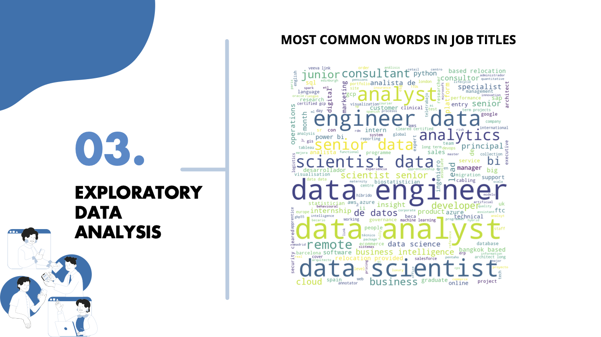
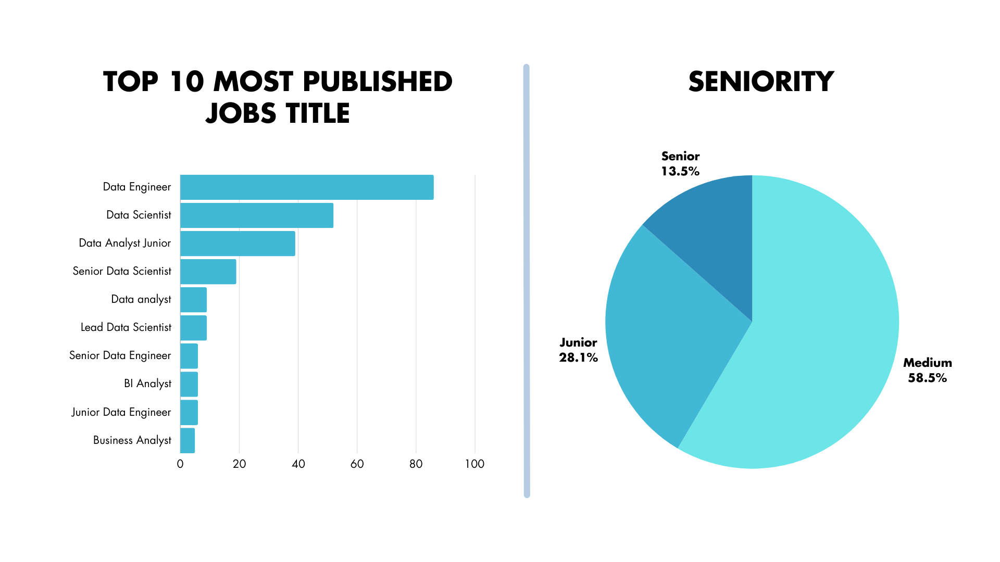
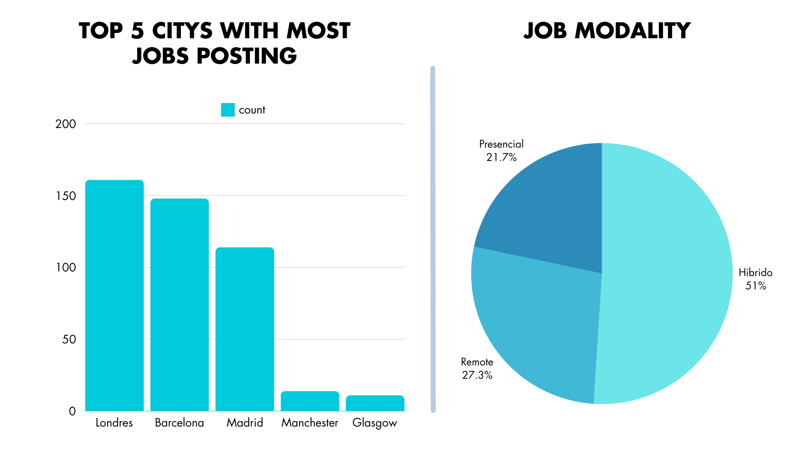
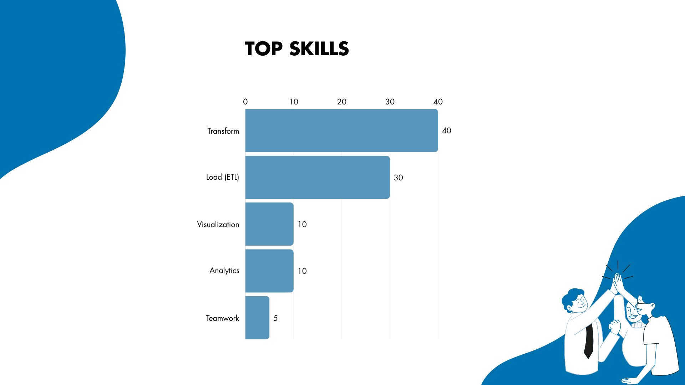

## Overview
This repository contains scripts and data related to web scraping and data cleaning for job listings on Glassdoor.
This analysis will help students focus their job search after completing the bootcamp in data analyst.

## Contents
- `scraping_glassdoor_ok.ipynb`: A Jupyter Notebook for scraping job data from Glassdoor.
- `clean_merge_datasets.ipynb`: A Jupyter Notebook for cleaning and merging the scraped datasets.
- `glassdoor_fin.xlsx`: The resulting Excel file after data cleaning and merging.

## Objectives:
- Augmenting Linkedin Dataset with Glassdoor Information through Web Scraping

## Hiphotesys:
By integrating LinkedIn job postings data from the previous month with the latest updates from Glassdoor, we aim to identify the most sought-after jobs by companies, the top cities with the highest number of job openings, and the essential skills required. 

## Results: 

### 2. Top 10 most published jobs title & Seniority

### 3. Top 5 citys with most jobs  posting & Job modality

### 4. Top skills

## Tools Used
- Python libraries:
- `BeautifulSoup` for web scraping.
- `pandas` for data manipulation and analysis.
- `numpy` for numerical operations.
- `seaborn` and `matplotlib` for visualizations.
- `Jupyter Notebooks` for interactive data analysis.

